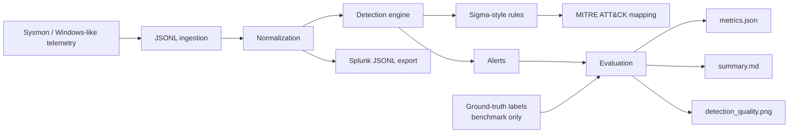

# Security Telemetry and Detection Lab

A reproducible defensive-security lab for endpoint telemetry ingestion, normalization,
detection, and evaluation. The project models process, authentication, network, and
process-access events; applies Sigma-style detections mapped to MITRE ATT&CK; and compares
baseline rules with context-aware tuning.

## Architecture



The `is_attack` field is used only as offline benchmark ground truth and is not consumed
by the detection engine.

## Features

- Deterministic generation of 100K+ Sysmon/Windows-style endpoint events
- Normalized schema for process, authentication, network, and process-access telemetry
- Sigma-style detection rules mapped to MITRE ATT&CK techniques
- Baseline and tuned detection modes for measuring alert-quality tradeoffs
- Precision, recall, false-positive-rate, and alert-count evaluation
- Splunk-compatible JSONL output and example SPL queries
- Reproducible benchmark artifacts and tests

## Quickstart

```bash
python -m venv .venv
# Windows
.venv\Scripts\activate
# macOS/Linux
source .venv/bin/activate

pip install -e .[dev]
python -m telemetry_lab.cli benchmark --events 120000 --seed 42 --out artifacts
pytest
```

The benchmark writes:

- `artifacts/raw_events.jsonl`
- `artifacts/normalized_events.jsonl`
- `artifacts/alerts.jsonl`
- `artifacts/metrics.json`
- `artifacts/summary.md`
- `artifacts/detection_quality.png`

## Telemetry

The synthetic generator creates repeatable benign background activity and labeled attack
scenarios across four event classes:

- process creation
- authentication
- network connection
- process access

This provides a controlled environment for testing detection logic and measuring changes
in alert quality.

## Detections

| Detection | MITRE ATT&CK |
|---|---|
| Encoded PowerShell | T1059.001 |
| Suspicious LSASS process access | T1003.001 |
| Remote interactive logon | T1021.001 |
| Unusual outbound admin-tool connection | T1041 |

The tuned rules add contextual filtering such as trusted administrative identities and
known system processes to reduce noisy alerts while preserving simulated attack coverage.

## Benchmark results

For the deterministic `--events 120000 --seed 42` benchmark:

| Metric | Baseline | Tuned |
|---|---:|---:|
| Recall | 1.000 | 1.000 |
| False positives | 10,150 | 6,799 |

The tuned rules reduce false positives by **33.0%** in this controlled benchmark while
maintaining the same recall. Full results are stored in `results/`.

## Splunk

`normalized_events.jsonl` is line-delimited JSON and can be imported into Splunk. Example
SPL searches are available in `splunk/queries.spl`.

## Testing

```bash
pytest
```

## Project structure

```text
src/telemetry_lab/   Core generation, normalization, detection, evaluation, and reporting
sigma_rules/         Sigma-style detection definitions
splunk/              Example SPL queries
tests/               Unit tests
results/             Reproduced benchmark metrics and visualization
```
